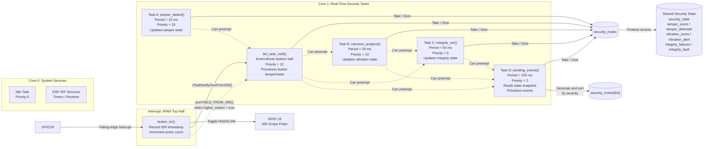

# SKIF-A7 SECURITY — Real-Time Systems Final Capstone

## Theme
A security montoring system that detects tampering, built to demonstarte FreeRTOS scheduling and synchronization
for an embedded systems role. 

## Demo
- Video: https://youtu.be/62XqjGxTQK4
- Live Wokwi: BLAIN-FINAL-RTS26Summer https://wokwi.com/projects/470533965934939137

## Architecture

Four periodic tasks perform tamper detection, vibration analysis, integrity verification, and event prioritization.
An interrupt-driven button ISR signals a high-priority bottom-half task through a direct task notification. 
THe shared security state is protected by a mutex. Fixed priority schedulability was verified using Rate-Monotonic
scheduling with measured WCETs and utilization analysis.

## Tasks & timing (WCET evidence)

| Task | Period T (ms) | WCET C (ms) | U = C/T | Priority | Deadline (ms) |
|------|--------------:|------------:|---------:|---------:|--------------:|
| Security Tamper | 10 | 0.217 | 0.022 | 15 | 10 |
| Intrusion Analysis | 20 | 4.443 | 0.222 | 10 | 20 |
| Integrity Verification | 50 | 2.140 | 0.043 | 5 | 50 |
| Pending Event Prioritization | 100 | 3.099 | 0.031 | 2 | 100 |
| **Total Utilization** | | | **0.318** | | |

Total utilization U = 0.318  
The measured total utilization is U=0.318, which is below both the four-task
Rate-Monotonic bound of 0.757 and the EDF bound of 1.0. Therefore, it is schedalable under both assumptions.

## Hazard analysis & standard mapping

| Hazard | Potential effect | Mitigation |
|---|---|---|
| Missed/delayed tamper event | Event may not be processed before its response deadline. | A minimal GPIO ISR records the event and wakes a priority-12 bottom-half task using a direct task notification. |
| Corrupted shared security state | Tasks may observe inconsistent combinations of tamper, vibration, integrity, and overall system state. | A FreeRTOS mutex protects multi-variable updates | 
| Integrity verification failure | Corrupted or unexpected data may be accepted as valid. | Task C calculates CRC-32, compares it with the expected value, records failures, and changes system state to `DEGRADED`. | 
| Mutex unavailable/held too long | Security tasks may block, time out, or skip shared-state updates. | Critical sections are kept short and mutex acquisitions use bounded timeouts. | 
| Excessive pending-event workload | Event prioritization may exceed its execution budget and interfere with higher-priority tasks. | Task D has the lowest priority, a fixed array size, a measured WCET, and a 100 ms period. |

## Graceful degradation

The system enters a controlled degrade state when accurate security information is unavailable. A CRC mismatch sets
`integrity_fault`, increments the integrity-failure count, and changes the security state to `SECURITY_DEGRADED`. 
If Task D cannot acquire the mutex while taking its snapshot, it assumes a fallback: integrity is treated as failed 
and the state is changed to `SECURITY_DEGRADED` instead of reporting normal operation.

## Build & run

**Toolchain:** Wokwi, ESP-IDF, FreeRTOS, and the ESP32-S3 toolchain  
**Target board:** ESP32-S3 DevKitC-1 / `freenove_esp32_s3_wroom`  
**Simulation:** Wokwi is used for functional and timing demonstrations

1. Open the project in Wokwi.
2. Confirm that the ESP32-S3 board, push button, and logic analyzer are included in the simulation.
3. Verify the hardware connections:
   - Push button connected between GPIO 18 and ground
   - Logic analyzer connected to GPIO 19
4. Start the simulation by selecting the Wokwi green arrow button.
5. Open the serial monitor to view task heartbeats, WCET measurements, security-state transitions, and interrupt-response latency.
6. Press the simulated button once to trigger the tamper alarm.
7. Press the button again to acknowledge and reset the tamper condition.
8. Stop simulation, file will automatically download to pc.
9. Open downloaded file using VCD viewer of your choice.
10. Record the maximum WCET values from the serial output and use them in the utilization and schedulability calculations.
11. Change the following compile-time setting to compare system behavior with and without background workload:

#define WITH_LOAD 1   // Run all four periodic security tasks
#define WITH_LOAD 0   // Run the interrupt path without background load

12. Change the following compile-time settings to induce failure:

#define INJECT_MUTEX_BLOCK 0  //runs noramlly
#define INJECT_MUTEX_BLOCK 1  //Task A takes and never releasesd mutex

## Tailored for

Embedded Software Engineer — This project demonstrates core embedded software skills including real-time task 
scheduling, interrupt handling, task synchronization, mutex-protection of shared resources, WCET measurement, 
and schedulability analysis. The design emphasizes deterministic behavior, concurrency, and timing verification 
using FreeRTOS on an ESP32-S3.

OpenAI ChatGPT https://chatgpt.com/share/6a6521c6-edf0-83ea-a980-f2de06140227
