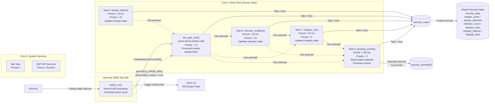

## Architecture

Four periodic tasks perform tamper detection, vibration analysis, integrity verification, and event prioritization.
An interrupt-driven button ISR signals a high-priority bottom-half task through a direct task notification. 
THe shared security state is protected by a mutex. Fixed priority schedulability was verified using Rate-Monotonic
scheduling with measured WCETs and utilization analysis.

